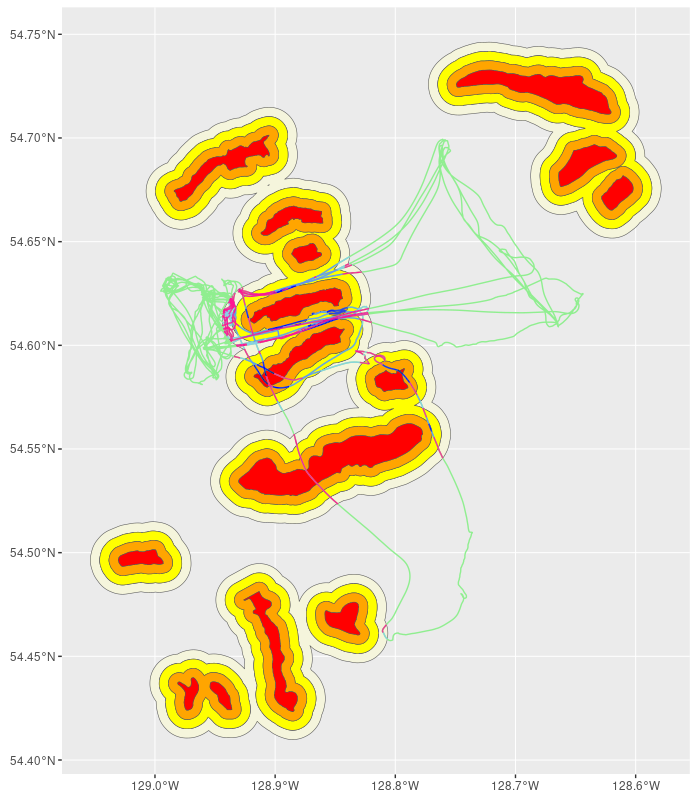
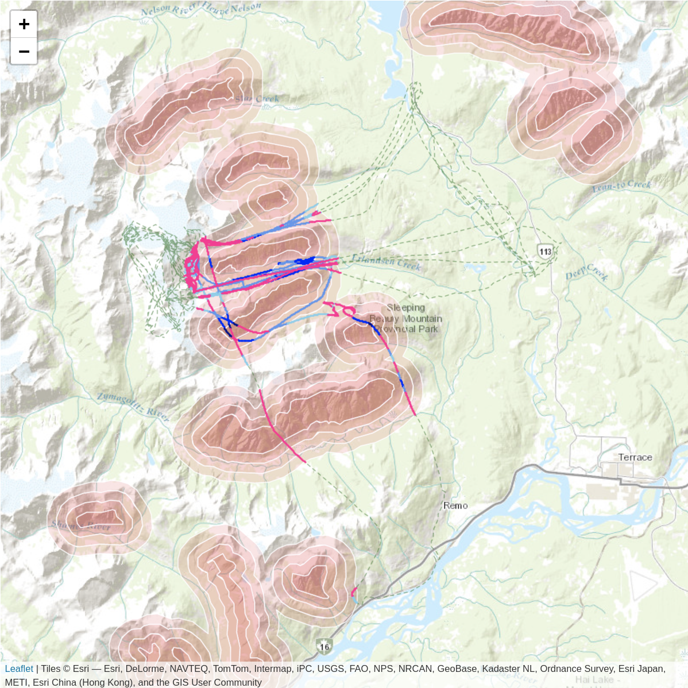

# Flight Path Monitoring Package

This package provides an analysis of flight paths over legal habitat areas for tenure holders. It determines the time and distance spent in each habitat area.

# Installation

## Requirements

- R base version `4.2.0` or greater.
- R package `terra` version `1.6.41` or greater.

```r
remotes::install_github("bcgov/flight-path-monitoring")
```

# Flight path analysis

```r
library(flight.path.monitoring)

```

## Performing the analysis
```r
system.file("flight.tar.gz", package = "flight.path.monitoring") |>
  untar(exdir = tempdir())

analysis <- file.path(tempdir(), "flight.gpx") |> read_flight() |> process_flight()
```

Other parameters such as maximal elevation can also be provided. See `?process_flight` help page for details.

## Visualising the analysis

### Flight analysis summary
```r
analysis
```

```
> analysis
   flight_id                  name        in_uwr          high      moderate           low           all filename
1:         1 Monday Morning Flight 30.88603 secs 552.8839 secs 1067.137 secs 4040.597 secs 5691.504 secs   flight
```

### Plot the flight analysis
```r
library(ggplot2)

ggplot() +
  geom_sf(data = analysis$zones$low, fill = "beige") +
  geom_sf(data = analysis$zones$moderate, fill = "yellow") +
  geom_sf(data = analysis$zones$high, fill = "orange") +
  geom_sf(data = analysis$zones$in_uwr, fill = "red") +
  geom_sf(data = analysis$flight |> sf::st_geometry(), colour = "lightgreen")+
  geom_sf(data = analysis$segments$in_uwr |> sf::st_geometry(), colour = "darkblue") +
  geom_sf(data = analysis$segments$high |> sf::st_geometry(), colour = "blue") +
  geom_sf(data = analysis$segments$moderate |> sf::st_geometry(), colour = "cornflowerblue") +
  geom_sf(data = analysis$segments$low |> sf::st_geometry(), colour = "skyblue") +
  geom_sf(data = analysis$segments$filtered |> sf::st_geometry(), colour = "deeppink")
```


```
library(leaflet)

leaflet() |>
  addProviderTiles(provider = "Esri.WorldTopoMap") |>
  addPolygons(data = analysis$zones$in_uwr, color = "white", opacity = 1, weight = 1, fillColor = "#db0f27", fillOpacity = 0.35) |>
  addPolygons(data = analysis$zones$high, color = "white", opacity = 1, weight = 1, fillColor = "#db0f27", fillOpacity = 0.275) |>
  addPolygons(data = analysis$zones$moderate, color = "white", opacity = 1, weight = 1, fillColor = "#db0f27", fillOpacity = 0.2) |>
  addPolygons(data = analysis$zones$low, color = "white", opacity = 1, weight = 1, fillColor = "#db0f27", fillOpacity = 0.125) |>
  addPolylines(data = analysis$flight, weight = 1, color = "darkgreen", dashArray = 4) |>
  addPolylines(data = analysis$segments$in_uwr, weight = 2, color = "darkblue", opacity = 1) |>
  addPolylines(data = analysis$segments$high, weight = 2, color = "blue", opacity = 1) |>
  addPolylines(data = analysis$segments$moderate, weight = 2, color = "cornflowerblue", opacity = 1) |>
  addPolylines(data = analysis$segments$low, weight = 2, color = "skyblue", opacity = 1) |>
  addPolylines(data = analysis$segments$filtered, weight = 2, color = "deeppink", opacity = 1)
```


## Processing a folder of flights
```r
f <- list.files("./data-raw/Heli data", pattern = "gpx$|kml$", recursive = TRUE, full.names = TRUE)

analysis <- f |> read_flight() |> process_flight(geom_out = FALSE)
  
print(analysis)  
```

```
> analysis
                       Flight          in_UWR             high         moderate             low              All                       filename
  1: Tuesday Afternoon Flight  28.869984 secs 11807.83021 secs 121975.7258 secs 1494.63335 secs 135307.0594 secs                      01-Feb-22
  2:   Tuesday Morning Flight   0.000000 secs  3270.91282 secs    161.5443 secs  177.57013 secs   3610.0273 secs                      01-Mar-22
  3: Wednesday Morning Flight   3.394391 secs  3781.81731 secs   5164.4627 secs 2023.00128 secs  10972.6757 secs                      02-Mar-22
  4:  Thursday Morning Flight  62.918563 secs  4329.35738 secs   6884.8993 secs 2367.56422 secs  13644.7394 secs                      03-Mar-22
  5:  Saturday Morning Flight 164.694805 secs  7999.55302 secs   3262.6721 secs 4119.25519 secs  15546.1752 secs                      05-Feb-22
 ---                                                                                                                                           
246:    Sunday Morning Flight  57.035988 secs   699.97372 secs   1101.1453 secs 3375.13108 secs   5233.2861 secs 20220417-151457-0029060-141724
247:   Tuesday Morning Flight   0.000000 secs    59.38758 secs    595.4419 secs 6898.46269 secs   7553.2921 secs 20220419-151732-0015173-141724
248: Wednesday Morning Flight  11.764096 secs   320.49865 secs   5114.8330 secs 1179.95549 secs   6627.0512 secs 20220420-152042-0030454-141724
249:  Thursday Morning Flight   0.000000 secs    21.07283 secs    198.5443 secs  352.59609 secs    572.2132 secs 20220421-152429-0030741-141724
250:    Friday Morning Flight   0.000000 secs    35.99603 secs   1114.6335 secs   91.78273 secs   1242.4123 secs 20220422-155759-0006006-141724
```
